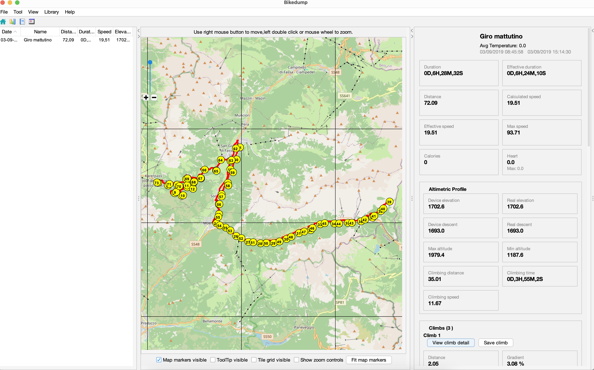
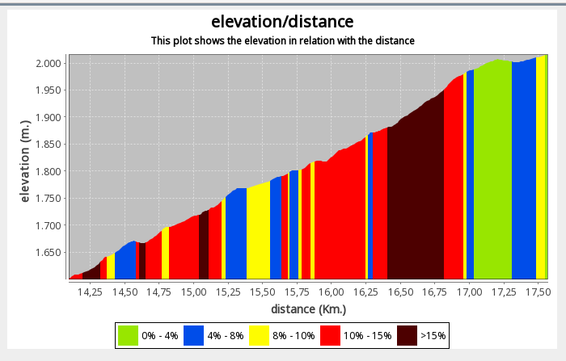
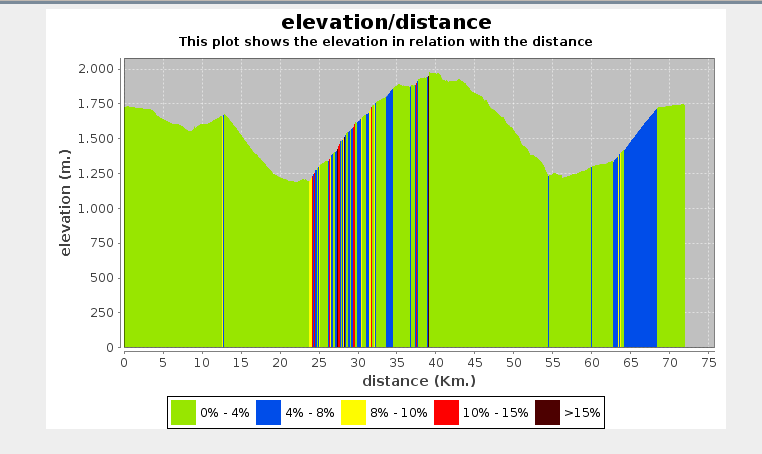
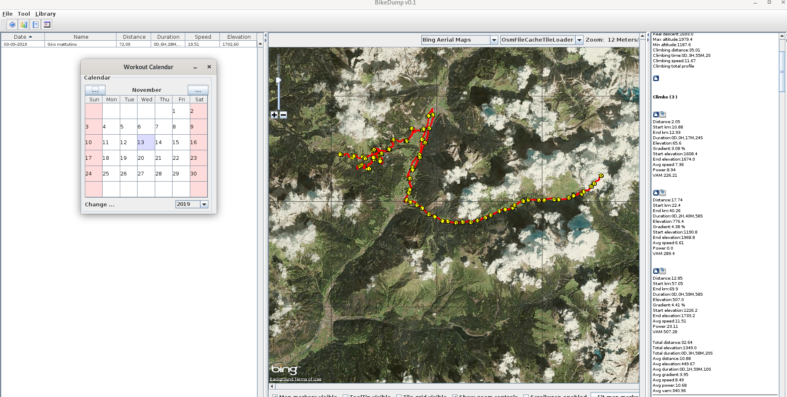
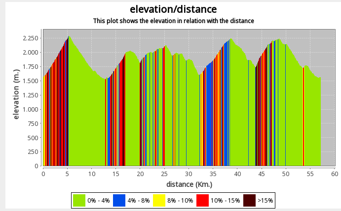

# 🚴 Bike Dump

[](https://www.oracle.com/java/)
[](LICENSE/)
[](dist/)

**Bike Dump** is a powerful Java GUI application designed to manage and extract comprehensive statistics from GPX 1.0, GPX 1.1, and TCX 2 activity files from your cycling and mountain biking workouts.

## Table of Contents

- [✨ Features](#-features)
- [🗺️ Offline Map Tiles](#️-new-feature-offline-map-tiles)
- [📸 Screenshots](#-screenshots)
- [📋 Prerequisites](#-prerequisites)
- [🚀 How to use](#-how-to-use)
- [🔨 How to Compile](#-how-to-compile)
- [📜 External Libraries & Licenses](#-external-libraries--licenses)

## Features

- 📊 **Comprehensive Statistics**: Extract detailed stats from your cycling activities
- 📈 **Interactive Graphs**: Visualize elevation, speed, distance, and time data
- 📅 **History Tracking**: Monitor your progress over time
- 🗺️ **Map Integration**: View your routes with interactive maps
- 🌐 **Offline Map Support**: Use offline map tiles to avoid rate limiting
- 📱 **Multiple Format Support**: Compatible with GPX 1.0, GPX 1.1, and TCX 2 formats

## Offline Map Tiles

Bike Dump supports offline map tiles to avoid rate limiting and 403 errors from online OpenStreetMap servers. See [OFFLINE_TILES.md](OFFLINE_TILES.md) for detailed setup instructions.

### Quick Setup:
1. Download map tiles in TMS format (`{z}/{x}/{y}.png`)
2. Go to **Options** → **Library** tab
3. Check "Use offline map tiles" and select your tiles directory
4. Enjoy unlimited map viewing without internet restrictions!

## Screenshots

<div align="center">

| Main Interface | Route Map | Statistics View |
|:-------------:|:---------:|:---------------:|
|  |  |  |

| Elevation Chart | Calendar View | Data Comparison |
|:---------------:|:-------------:|:---------------:|
|  |  |  |

</div>

## Prerequisites

- **Java 11 or higher** (tested with Java 11, 17, and 21)
- **Apache Maven** (for building from source)

## How to use

Run Bike Dump with the pre-built jar:

```bash
java -jar dist/bikedump-0.3.0-release.jar
```

## How to Compile

### Step 1: Install dependencies
Before compiling, add the required libraries to your local Maven repository:

```bash
cd dist
sh install-libs.sh
```

### Step 2: Compile the project
Compile the source code with Apache Maven:

```bash
mvn clean compile
```

### Step 3: Create executable jar
Build the executable jar file:

```bash
mvn clean package
```

### Step 4: Run the compiled version
Execute the newly built jar:

```bash
java -jar target/bikedump-0.3.0-release.jar
```

## External Libraries & Licenses

Bike Dump uses the following external libraries:

| Library | Link | License |
|---------|------|---------|
| sunrisesunsetlib | [GitHub](https://github.com/mikereedell/sunrisesunsetlib-java) | [Apache 2.0](https://www.apache.org/licenses/LICENSE-2.0) |
| jmapviewer | [OpenStreetMap Wiki](http://wiki.openstreetmap.org/wiki/JMapViewer) | [GPL](https://www.gnu.org/licenses/gpl-3.0.html) |
| kryo | [GitHub](https://github.com/EsotericSoftware/kryo) | [BSD-3-Clause](https://opensource.org/licenses/BSD-3-Clause) |
| ormlite-core | [GitHub](https://github.com/j256/ormlite-core) | [ISC](https://opensource.org/licenses/ISC) |
| JFreeChart | [GitHub](https://github.com/jfree/jfreechart) | [LGPL-2.1](https://www.gnu.org/licenses/old-licenses/lgpl-2.1.html) |


For additional details see: [NOTICE file](LICENSE/NOTICE.md)
