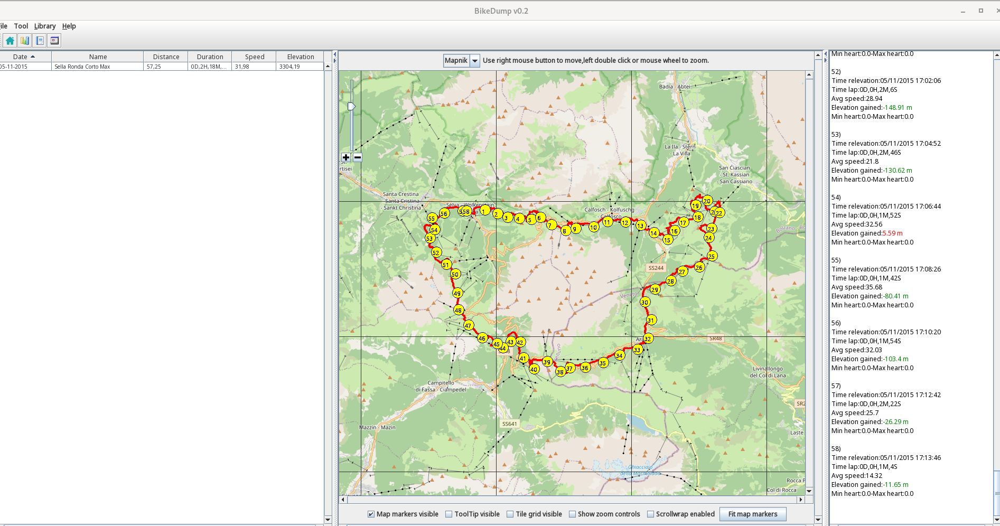
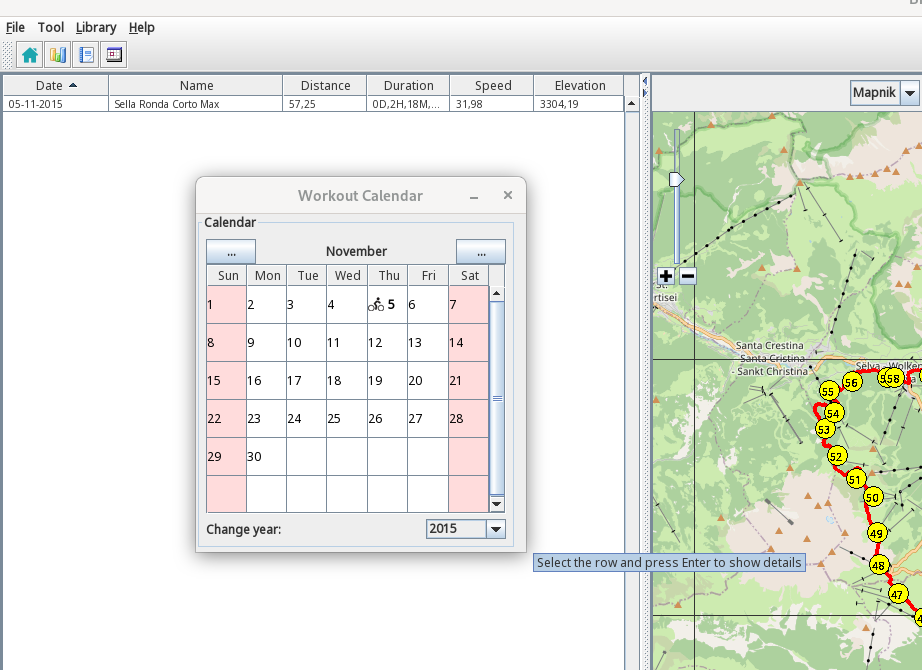
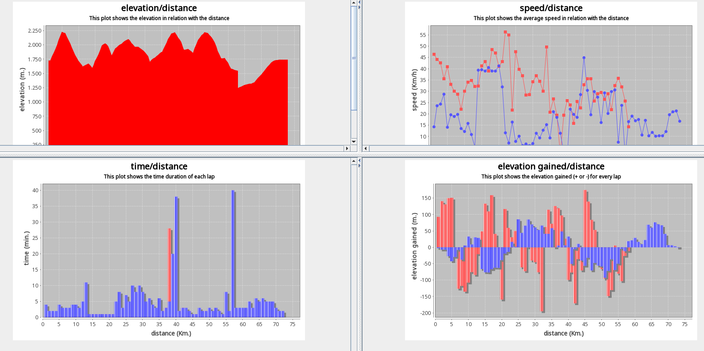

# Bikedump

Bikedump is a Java GUI implementing GPX 1.0, GPX 1.1 and TCX 2 formats.

It can be used to manage and extract stats from gps gpx tcx activities.

It also offers graphs and history stats.


## Screenshots








## Prerequisites

java >= 11

## Compile, Test, Run

### Compile: ###

Before compiling add the libraries to maven repo:

```
cd dist
sh install-libs.sh
```

```
mvn clean compile
```

### Executable jar: ###

```
mvn clean package
```

### Run Bikedump: ###

```
java -jar target/bikedump-0.2.2-release.jar
```

## External libraries: LICENSE

bikedump uses these external libraries:

| Library          | Link                                                 | License                                                             |      
|------------------|------------------------------------------------------|---------------------------------------------------------------------|
| sunrisesunsetlib | https://github.com/mikereedell/sunrisesunsetlib-java | [Apache 2.0](https://www.apache.org/licenses/LICENSE-2.0)           |
| jmapviewer       | http://wiki.openstreetmap.org/wiki/JMapViewer        | [GPL](https://www.gnu.org/licenses/gpl-3.0.html)                    |                         | [MIT](https://opensource.org/licenses/MIT)                          |         
| kyro             | https://github.com/EsotericSoftware/kryo             | [BSD-3-Clause](https://opensource.org/licenses/BSD-3-Clause)        | 
| ormlite-core     | https://github.com/j256/ormlite-core                 | [ISC](https://opensource.org/licenses/ISC)                          |          
| JFreeChart       | https://github.com/jfree/jfreechart                  | [LGPL-2.1](https://www.gnu.org/licenses/old-licenses/lgpl-2.1.html) |     

For additional details see:
[NOTICE file](LICENSE/NOTICE.md)

## Changes

[Changelog file](CHANGES.md)

